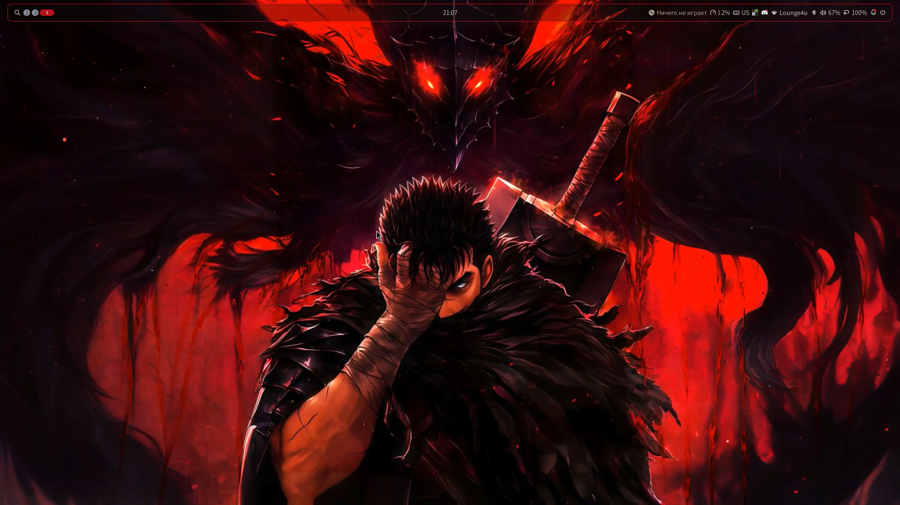

<p align="center">
  <a href="https://github.com/noctalia-dev/noctalia">
    
  </a>
</p>

<h1 align="center">Berserk Dots</h1>

<p align="center">
  Тёмный рабочий стол на <b>Arch Linux · Hyprland · Noctalia</b> в стиле Berserk.<br>
  Чёрный фон, оранжевый акцент, видеообои, красный знак в терминале.
</p>

<p align="center">
  
  
  
  
</p>

<p align="center"></p>

> Установщик с меню: каждый ставит только то, что нужно. Всё, что заменяется, сначала сохраняется в резервную копию.

---

## Быстрая установка

Нужен Arch Linux с интернетом и обычный пользователь с `sudo`.

```bash
git clone https://github.com/igor3494/berserk-dots.git
cd berserk-dots
./install.sh --dry-run    # посмотреть, что будет сделано, ничего не меняя
./install.sh              # меню выбора модулей
```

Или одной командой:

```bash
bash <(curl -fsSL https://raw.githubusercontent.com/igor3494/berserk-dots/main/bootstrap.sh)
```

В меню вводи номера модулей (вкл/выкл), `a` выбрать всё, `n` снять всё, Enter начать.
После установки перезайди в сессию Hyprland. Подробная пошаговая инструкция: [docs/INSTALL.md](docs/INSTALL.md).

## Модули

| № | Модуль | Что делает |
|---|---|---|
| 1 | `base` | yay, звук (pipewire), Bluetooth, NetworkManager, шрифты |
| 2 | `gpu` | NVIDIA для гибридных ноутбуков AMD + NVIDIA |
| 3 | `desktop` | Hyprland, Noctalia, порталы |
| 4 | `terminal` | kitty, zsh с подсказками, starship, fastfetch, cava, btop |
| 5 | `apps` | Firefox, Dolphin, Discord, Obsidian, VS Code |
| 6 | `dolphin` | Dolphin в цветах Берсерка: тема, иконки, красные папки |
| 7 | `theme` | палитры Noctalia, бар, панели, сочетания клавиш, подсказки по клавишам |
| 8 | `video` | видеообои через плагин mpvpaper |
| 9 | `asus` | asusctl и supergfxctl (только ноутбуки ASUS ROG) |
| 10 | `extras` | KDE Connect, Thunar, скриншоты |

## Что нужно добавить самому

Арты, обои и видео по Berserk защищены авторским правом, поэтому в репозитории их нет:

- **обои:** скачай и положи в `~/Pictures`;
- **видеообои:** ролик в `~/Videos`, выбор командой `noctalia msg panel-toggle noctalia/mpvpaper:picker`;
- **знак в терминале:** PNG на прозрачном фоне как `~/Pictures/berserk-logo.png`.

Подробности в [assets/README.md](assets/README.md).

## Сочетания клавиш

`SUPER + H` открывает окно со всеми сочетаниями (поиск: просто печатай). Главные:

| Клавиши | Действие |
|---|---|
| `SUPER + Return` | терминал |
| `SUPER + Q` / `T` / `D` / `C` / `O` | Firefox / Dolphin / Discord / VS Code / Obsidian |
| `SUPER + Space` | лаунчер Noctalia |
| `SUPER + S` | центр управления |
| `SUPER + ,` | настройки Noctalia |
| `SUPER + X` | закрыть окно |
| `SUPER + F` / `SUPER + SHIFT + F` | на весь экран / плавающее окно |
| `SUPER + P` | скриншот области в буфер |
| `SUPER + SHIFT + P` | скриншот экрана в файл |
| `SUPER + ALT + P` | скриншот области в файл |
| `ALT + Tab` | переключатель окон |
| `ALT + SHIFT` | раскладка RU/EN |

## Палитры

В `~/.config/noctalia/config.toml` поменяй значение `custom_palette`:

- `BerserkMono`: чёрный с оранжевым (по умолчанию);
- `BerserkRed`: чёрный с кроваво-красным и золотым.

## Обновление и откат

```bash
cd ~/berserk-dots && git pull && ./install.sh
```

Заменённые файлы лежат в `~/.config-backup-ДАТА/`. Резервную копию своих настроек делает `./backup.sh`.

## Если что-то пошло не так

- Полоса с ошибкой сверху: `hyprctl configerrors`, и верни копию `hyprland.lua` из `~/.config-backup-ДАТА/.config/hypr/`.
- Проверка Noctalia: `noctalia config validate`.
- Настройки, которые менялись мышкой в Noctalia, лежат в `~/.local/state/noctalia/settings.toml` и перебивают файлы из репозитория.
- Конфиги рассчитаны на Noctalia v5 и Hyprland с Lua-конфигом (0.55 и новее).

## Приватность

Из репозитория ничего личного не устанавливается и не публикуется: профили браузеров, пароли, ключи и история
сюда не попадают. Защитный хук `.githooks/pre-commit` блокирует коммит с такими файлами. Имена и пароли пользователь
вводит сам: `install.sh` спросит только имя компьютера и данные для git, а пароли скрипты не видят
(их вводят в системную команду `passwd`, см. `setup-account.sh`).

## Благодарности

[Noctalia](https://github.com/noctalia-dev/noctalia), [Hyprland](https://github.com/hyprwm/Hyprland),
[kitty](https://sw.kovidgoyal.net/kitty/), [fastfetch](https://github.com/fastfetch-cli/fastfetch),
[mpvpaper](https://github.com/GhostNaN/mpvpaper), [Papirus](https://github.com/PapirusDevelopmentTeam/papirus-icon-theme).

Логотип Noctalia принадлежит проекту Noctalia и используется только чтобы показать совместимость.

## Лицензия

MIT, только для конфигов из этого репозитория. См. [LICENSE](LICENSE).
